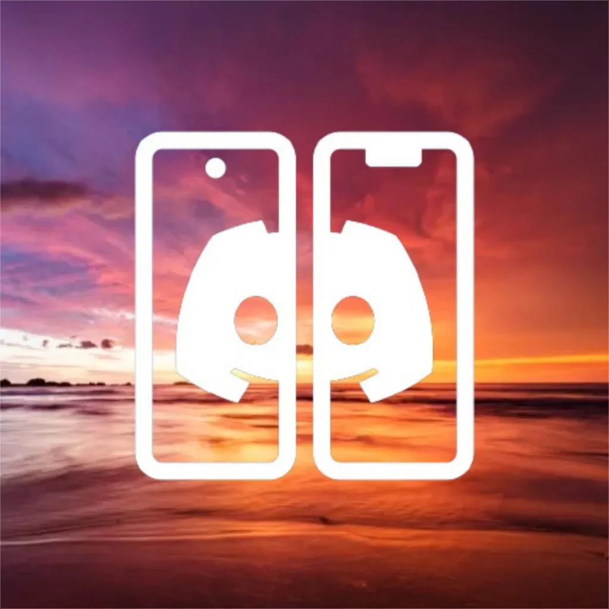

  
  
  # Sunset

  A mod for @discord's mobile apps. Forked from Vendetta's recent sunset.

## Installing 

### iOS
1. Read https://github.com/sunset-mod/SunsetTweak installation instructions.

### Android
1. Open Vendetta settings.
2. Enable Developer settings.
3. Enable "Load Vendetta from a custom URL.".
4. Paste https://raw.githubusercontent.com/sunset-mod/builds/master/sunset.js in it.
5. Reload.
